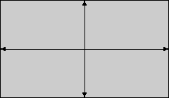

# s3-placehold

An S3-compatible placeholder image server. Instead of storing objects, it
**synthesizes** an image on demand from parameters encoded in the request key —
no bucket to pre-populate, no fixtures to check in. Point any S3 client or SDK
at it and ask for `size=300x200/format=png/colour=lightblue` and get back a real
PNG of that size and colour, generated on the fly.

It's meant for local development and testing: seeding UI screenshots, exercising
image-loading code paths, or standing in for a real S3/CDN endpoint in a
docker-compose stack.

## Quick start

```sh
docker run --rm -p 9000:9000 \
  -e BUCKETS=images:public,assets:private \
  -e AWS_ACCESS_KEY_ID=demo \
  -e AWS_SECRET_ACCESS_KEY=demosecret \
  ghcr.io/michaelvl/s3-placehold/s3-placehold:latest
```

This configures a public `images` bucket and a private `assets` bucket; every
example below runs against this one container. (With no `BUCKETS`/credentials
set at all, the server instead defaults to a single public bucket named
`placeholder` on port `9000`.)

Fetch a placeholder image from the public bucket (path-style:
`/{bucket}/{key}`):

```sh
curl http://localhost:9000/images/size=300x200/format=png/colour=lightblue -o out.png
```

### More GetObject / HeadObject examples

```sh
# Defaults: 100x100 svg, #cccccc background
curl http://localhost:9000/images/

# Text overlay ("+" is a space)
curl http://localhost:9000/images/format=png/size=400x200/text=hello+world -o out.png

# Alignment guides, to see how a layout crops or scales the image
curl http://localhost:9000/images/format=png/size=400x300/guides=cross,frame -o out.png

# Simulated latency: fixed 200ms, or a random 100-500ms
curl http://localhost:9000/images/delay=200
curl http://localhost:9000/images/delay=100,500

# HeadObject: same synthesis, headers only, no body
curl -I http://localhost:9000/images/format=png/size=200x300
```

Virtual-hosted style (`{bucket}.{host}`) works too — resolve the bucket
subdomain to the server, or fake it with curl's `--resolve`/`Host` header:

```sh
curl --resolve images.localhost:9000:127.0.0.1 \
  http://images.localhost:9000/format=png
```

### Listing and delete (no-ops)

`ListObjects`/`ListObjectsV2`, `DeleteObject`, and batch `DeleteObjects` are
accepted and return well-formed but empty/no-op responses — nothing is ever
actually stored, so there's nothing to list or delete:

```sh
curl "http://localhost:9000/images/?list-type=2"
curl -X DELETE http://localhost:9000/images/format=png
curl -X POST "http://localhost:9000/images/?delete"
```

### Private buckets and presigned URLs

A `private` bucket requires a valid AWS SigV4 signature — either as an
`Authorization` header or as a presigned URL's query parameters. Hand-rolling a
SigV4 signature isn't practical with plain `curl`; use the AWS CLI or any AWS
SDK pointed at the server as a custom endpoint. The `assets` bucket configured
above is `private`:

```sh
export AWS_ACCESS_KEY_ID=demo
export AWS_SECRET_ACCESS_KEY=demosecret

aws --endpoint-url http://localhost:9000 s3api get-object \
  --bucket assets --key format=png/size=300x300 out.png

# Presigned URL (rejected once its expiry window elapses)
aws --endpoint-url http://localhost:9000 s3 presign \
  s3://assets/format=png/size=300x300 --expires-in 300
```

## Parameters

Every request key is a sequence of `/`-separated `name=value` segments, in any
order, all optional:

```
/format=png/size=200x300/colour=ff0000/text=hello+world
/colour=ff0000,00ff00,0000ff/gradient=mesh
```

| Segment    | Value syntax                                                                                                                               | Default                                                                         | Notes                                                                                                                                                                     |
| ---------- | ------------------------------------------------------------------------------------------------------------------------------------------ | ------------------------------------------------------------------------------- | ------------------------------------------------------------------------------------------------------------------------------------------------------------------------- |
| `type`     | `image`                                                                                                                                    | `image`                                                                         | Routes to a synthesis pipeline. Only `image` exists today; unknown values → 400.                                                                                          |
| `format`   | `svg` \| `png` \| `jpeg`                                                                                                                   | `svg`                                                                           | Output format and `Content-Type`. Other values → 400.                                                                                                                     |
| `size`     | `{width}x{height}`, e.g. `200x300`                                                                                                         | `DEFAULT_SIZE` (`100x100`)                                                      | Pixels. Non-integer or non-positive → 400.                                                                                                                                |
| `colour`   | Up to 8 comma-separated values, each lowercase hex without `#` (`ff0000`), a CSS named colour (`lightblue`), or `random` / `random:{seed}` | `DEFAULT_COLOUR` (`cccccc`)                                                     | Background fill. Two or more colours are painted as a gradient. Unrecognised value, or more than 8 → 400.                                                                 |
| `gradient` | `linear` with an optional angle (`linear:45`) \| `radial` \| `mesh` \| `none`                                                              | `DEFAULT_GRADIENT`, else `linear:90` for multi-colour keys and `none` otherwise | Geometry the `colour` list is painted with. Needs two or more colours — anything but `none` with a single colour → 400. Other values → 400.                               |
| `guides`   | Comma-separated list of `cross`, `frame`, `corners`, `thirds`, or `all` / `none` on their own                                              | `DEFAULT_GUIDES` (none)                                                         | Alignment overlay drawn inside the image. Unrecognised name, or `all`/`none` in a list → 400.                                                                             |
| `text`     | URL-encoded string, `+` = space                                                                                                            | _(none)_                                                                        | Overlaid on the image; colour auto-contrasts against the background.                                                                                                      |
| `delay`    | Fixed ms (`200`) or an inclusive random range (`100,500`)                                                                                  | `DEFAULT_DELAY_MS`                                                              | Server sleeps before responding, to simulate slow storage. Defaults to no delay unless `DEFAULT_DELAY_MS` is set; an explicit `delay` (including `delay=0`) overrides it. |

### Random colours

Any `colour` list member can be `random`, which picks a stable colour rather
than a different one per request — the same key always renders the same image:

```
/text=maria/colour=random              # a colour derived from this key
/colour=random:avatar42                # a colour derived from "avatar42"
/colour=random,random/gradient=mesh    # a random multi-colour mesh
/colour=ff0000,random                  # mix fixed and random
```

`random:{seed}` hashes the seed you give it and nothing else, so the colour is
pinned no matter what else the key contains. Bare `random` hashes the `size` and
`text` of the request, plus the member's position in the `colour` list. That
means:

- `format` and `delay` are **not** part of the seed, so asking for the same
  image as PNG instead of SVG keeps its colour.
- Segment order is not part of the seed either — the hash is built from parsed
  values, so `/size=100x100/text=hi` and `/text=hi/size=100x100` agree.
- Position **is** part of the seed, so `colour=random,random` gives two
  different colours rather than a degenerate one-colour gradient. Adding a
  colour to the front of a list shifts the ones after it.

Colours vary in hue at a fixed saturation and lightness, so every result is
vivid rather than muddy. The hash, that mapping and the seed construction are
fixed: they define which colour a seed produces, and changing them would repaint
every existing `colour=random` URL.

`DEFAULT_COLOUR` accepts `random` too, and is resolved per request rather than
once at startup — so `DEFAULT_COLOUR=random` gives _every distinct key_ its own
stable colour without any key having to ask, and `DEFAULT_COLOUR=random,random`
does the same with a gradient.

A seed collapses that back to a single colour. `random:{seed}` ignores the
request by definition, so as a server-wide default it renders the same colour
for every key — `DEFAULT_COLOUR=random:staging` behaves exactly as if you had
written that colour's hex. The point is to _name_ a colour rather than choose
one: two deployments set `random:staging` and `random:prod` and get two
distinct, vivid colours without anyone picking hex values or checking they are
far enough apart. The trade is that you cannot tell what colour a seed gives
until you run the server and look.

### Gradients

Two or more `colour` values are painted as a gradient, defaulting to a
left-to-right linear ramp. `gradient` selects the geometry:

- `linear:{deg}` — a straight ramp. The angle follows the CSS `linear-gradient`
  convention: `0` points towards the top and increases clockwise, so `90` is
  left-to-right. Angles outside `[0,360)` are wrapped.
- `radial` — a circle centred on the image, sized so the last colour reaches the
  corners. Note this is a circle, not the ellipse CSS `radial-gradient` defaults
  to, so on a very wide image the last colour only shows near the corners.
- `mesh` — the first colour fills the background and each remaining colour is a
  soft blob at a fixed position, giving colour that varies across both axes.
  Blob positions are fixed, not random, so a key always renders the same image.
- `none` — a flat fill of the first colour. Useful to override a configured
  `DEFAULT_GRADIENT`, in the same way `delay=0` overrides `DEFAULT_DELAY_MS`.

Geometry is chosen by the first of these that applies: an explicit `gradient`
segment, then `DEFAULT_GRADIENT`, then `linear:90` if the key has more than one
colour, then a flat fill. So `DEFAULT_GRADIENT=none` makes a multi-colour key
paint flat unless it names a `gradient` of its own.

A gradient needs at least two colours to interpolate between, and the two ways
of asking for one are treated differently:

- A key naming a `gradient` with a single colour is **rejected with a 400** —
  `/colour=lightblue/gradient=radial` is a mistake worth reporting, not a
  request for a flat fill. Add a second colour (`colour=lightblue,steelblue`),
  or ask for `gradient=none`.
- A key with a single colour under a configured `DEFAULT_GRADIENT` simply paints
  flat. That key requested no gradient, so there is nothing to report.

All three formats render the same picture: `format` selects the encoding, not
the image. SVG output stays a few hundred bytes whatever the requested `size`,
since it is emitted as gradient definitions rather than pixels; PNG output of a
smooth gradient compresses well for the same reason.

### Guides

`guides` overlays alignment marks on the image, in the same auto-contrasting
colour as `text`. They're for judging how a placeholder is being _displayed_ —
whether your layout crops it, letterboxes it, or scales it off-centre:

- `cross` — a horizontal and a vertical line through the centre, each ending in
  an arrowhead whose tip touches the border. The arrowheads are the point: a
  line running off an edge looks the same cropped or not, a missing tip does
  not. Off-centre placement shows up as the two lines meeting somewhere other
  than the middle of the visible box.
- `frame` — a hairline along all four edges. Any crop eats a whole side.
- `corners` — heavier L-shaped crop marks flush with each corner, like a print
  reference. Survives a crop that only nibbles an edge, so it tells you _how
  much_ was lost.
- `thirds` — a rule-of-thirds grid, for judging composition against the visible
  box.
- `all` — all four. `none` — no overlay, useful to override a configured
  `DEFAULT_GUIDES`, in the same way `gradient=none` overrides
  `DEFAULT_GRADIENT`.

```sh
curl http://localhost:9000/images/format=png/size=400x300/guides=cross -o out.png
curl http://localhost:9000/images/size=400x300/guides=cross,frame
curl http://localhost:9000/images/size=400x300/guides=all/text=hero
```

Names combine in any order and duplicates collapse, so `guides=frame,cross` and
`guides=cross,frame,cross` render the same image. `all` and `none` describe the
whole list, so they're only accepted on their own — `guides=none,cross` is a 400
rather than a guess at what you meant.

Everything is drawn **inside** the image bounds, never bleeding outside it —
that is what makes a crop visible in the result itself. Line weight and mark
size scale with the image's shorter side, so a 100x100 thumbnail and a 4000px
render look like the same reference. Guides are drawn under `text`, so a `text`
label stays readable with the cross running behind it.

## Configuration

All configuration is via environment variables:

| Variable                | Purpose                                                                                                                                 | Default              |
| ----------------------- | --------------------------------------------------------------------------------------------------------------------------------------- | -------------------- |
| `PORT`                  | Listening port                                                                                                                          | `9000`               |
| `BUCKETS`               | Comma-separated `name:mode` pairs (`public`/`private`)                                                                                  | `placeholder:public` |
| `AWS_ACCESS_KEY_ID`     | SigV4 access key (required if any bucket is `private`)                                                                                  | _(none)_             |
| `AWS_SECRET_ACCESS_KEY` | SigV4 secret key (required if any bucket is `private`)                                                                                  | _(none)_             |
| `MAX_X_PIXELS`          | Maximum allowed `size` width, in pixels                                                                                                 | `10000`              |
| `MAX_Y_PIXELS`          | Maximum allowed `size` height, in pixels                                                                                                | `10000`              |
| `DEFAULT_SIZE`          | Size for keys with no `size` segment, as `{width}x{height}`                                                                             | `100x100`            |
| `DEFAULT_COLOUR`        | Background fill for keys with no `colour` segment: up to 8 comma-separated hex values, CSS colour names, or `random` / `random:{seed}`  | `cccccc`             |
| `DEFAULT_GRADIENT`      | Gradient geometry for keys with no `gradient` segment: `linear[:deg]`, `radial`, `mesh` or `none`                                       | _(none)_             |
| `DEFAULT_GUIDES`        | Alignment overlay for keys with no `guides` segment: a comma-separated list of `cross`, `frame`, `corners`, `thirds`, or `all` / `none` | _(none)_             |
| `DEFAULT_DELAY_MS`      | Delay for keys with no `delay` segment: fixed ms (`200`) or a range (`100,500`)                                                         | `0` (no delay)       |

## Key limitations vs. real AWS S3

- **Nothing is stored.** Every `GetObject`/`HeadObject` is synthesized fresh
  from the key; there's no bucket contents, no persistence, no ETags tied to
  real object state.
- **Listing is always empty.** `ListObjects`/`ListObjectsV2` return a valid but
  empty result regardless of what's been "written".
- **Writes and deletes are no-ops.** `PUT`/`DeleteObject`/`DeleteObjects` don't
  fail, but nothing happens — good enough to unblock a client's cleanup code,
  not to test it.
- **Single credential pair, no IAM.** One access/secret key validates SigV4
  signatures; there's no per-bucket policy, ACLs, or multi-user auth.
- **CORS is always permissive** (`Access-Control-Allow-Origin: *`) — there's no
  per-bucket CORS configuration.
- **No multipart upload, versioning, or object metadata** beyond the
  `Content-Type`/`Content-Length` implied by the key.
- **Large `mesh` images are slow to synthesize.** Mesh cost grows with width x
  height x colours; at the default `MAX_X_PIXELS`/`MAX_Y_PIXELS` of 10000 it
  takes seconds. Lower the caps if that matters — a raster image that large is
  already expensive to encode regardless of the gradient.

## Gallery

Every image below is the output of the command above it, against the container
from [Quick start](#quick-start). `hack/gen-examples.sh` (or `make examples`)
regenerates `examples/` by extracting these commands from this section and
running them as they are written, so what you see is what the server produces.

A single colour, painted flat:

```sh
curl http://localhost:9000/images/format=png/size=240x140/colour=lightblue -o examples/flat-colour.png
```


Two colours become a gradient; `linear:45` tilts the ramp 45° clockwise from
pointing up:

```sh
curl http://localhost:9000/images/format=png/size=240x140/colour=ff8a00,e52e71/gradient=linear:45 -o examples/linear-gradient.png
```


`radial` centres the first colour and pushes the last one to the corners:

```sh
curl http://localhost:9000/images/format=png/size=240x140/colour=fefefe,2b5876/gradient=radial -o examples/radial-gradient.png
```


`mesh` fills with the first colour and drops the rest in as soft blobs, so the
colour varies across both axes:

```sh
curl http://localhost:9000/images/format=png/size=240x140/colour=1e3a8a,06b6d4,f472b6/gradient=mesh -o examples/mesh-gradient.png
```


`text` is overlaid in a colour that contrasts with the background — `+` is a
space:

```sh
curl http://localhost:9000/images/format=png/size=240x140/text=hello+world -o examples/text.png
```


`guides` marks the centre and the edges, so you can see whether a layout crops
or off-centres the image:

```sh
curl http://localhost:9000/images/format=png/size=240x140/guides=cross,frame -o examples/guides.png
```



`random:{seed}` picks a stable vivid colour from a name you choose, rather than
from the rest of the key — handy for stand-in avatars:

```sh
curl http://localhost:9000/images/format=png/size=140x140/colour=random:avatar42/text=MV -o examples/avatar.png
```


Bare `random` derives its colours from the key itself, so every distinct key
gets its own gradient and keeps it:

```sh
curl http://localhost:9000/images/format=png/size=240x140/colour=random,random/text=maria -o examples/random-gradient.png
```


Segments combine in any order:

```sh
curl http://localhost:9000/images/format=png/size=240x140/colour=steelblue,lightblue/gradient=linear:135/guides=corners/text=hero -o examples/hero.png
```


